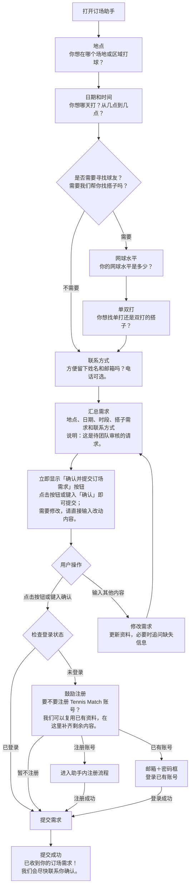
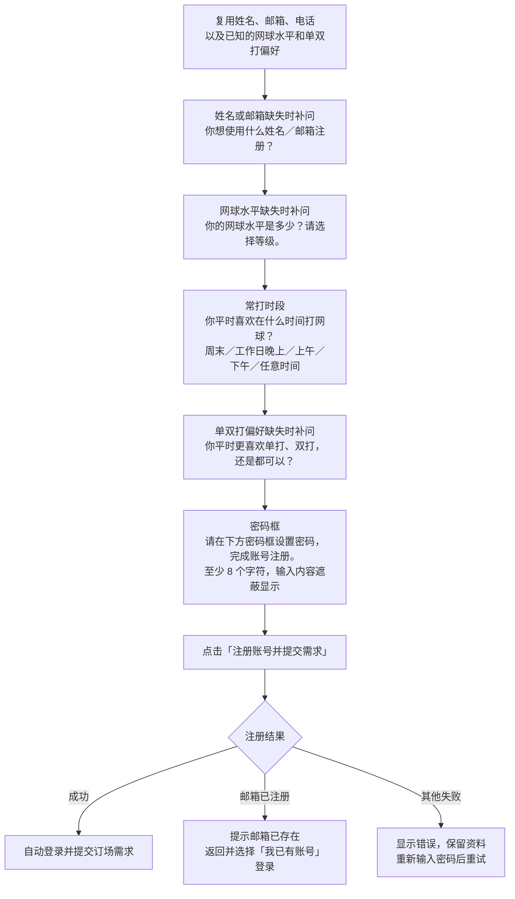

# 订场助手流程图与话术

以下为当前订场助手的询问、确认提交及注册流程。需求收集阶段的话术为示例，由模型根据上下文生成；已提供的信息会跳过，每次只追问一到两个缺失问题。

## 需求收集与提交

汇总时直接显示按钮，无需先发送确认再点击一次提交。英文对话也可键入 `confirm`。其他输入用于修改需求；修改期间隐藏旧提交按钮，收到新的完整汇总后重新显示。

这里检查的是登录状态。已有账号但未登录的用户可以选择登录；注册是可选项，用户也可以直接以游客身份提交。

## 助手内注册

密码框的内容直接发送给账号接口，不进入模型对话、订场需求或浏览器存储。注册成功而订场提交失败时，保留登录状态和需求，用户可重试提交。

## 对应代码

| 内容 | 文件 |
| --- | --- |
| 系统提示词、需求字段、汇总就绪判断 | [app/api/chat/route.ts](../app/api/chat/route.ts) |
| 欢迎语、确认提交、登录检查与注册入口 | [components/booking-chat.tsx](../components/booking-chat.tsx) |
| 注册与登录话术、逐项补齐资料、密码输入框 | [components/booking-chat-account.tsx](../components/booking-chat-account.tsx) |
| 需求类型、搭子信息完整性、文字确认识别 | [lib/booking-assistant.ts](../lib/booking-assistant.ts) |
| 需求校验、搭子需求保存到备注 | [lib/server/reservation-request-validation.ts](../lib/server/reservation-request-validation.ts) |
